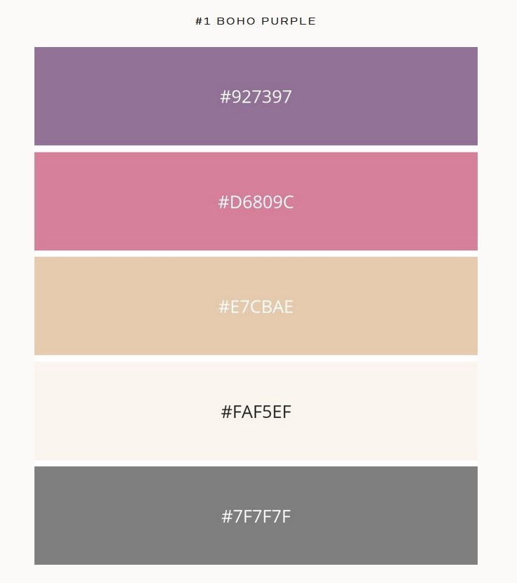

# Yup Yoga

Yup Yoga is hoping to a bring a wide variety of yoga classes to people who are looking to begin practising yoga. It will also be targeted at people who want to challenge themselves and add a new way of exercising to their fitness journey. The Yup Yoga website will be a way for people learn about the different yoga styles and also a place they can book classes.

## User Experience (UX)

### User stories

#### First Time Visitor Goals

- First Time Visitor,

#### Returning Visitor Goals

- Returning Visitor,

#### Frequent User Goals

As a Frequent User,

### Website Layout

- for wire frames and responsive

### Design

#### Colour Scheme

- Found online this colour scheme is called Boho Purple. It is a perfect choice for a yoga website. Website credited in credits.

#### Typography

- Abril Fatface is the heading font for this website. it was choen for its decorative and casual style, while still being easily ledgeable.
- Poppins was chosen for the content of the page because of its sharp lines and its pairing to Abril Fatface.
- san-seraf is the fallback font incase either of the main fonts fail to be imported from Google fonts.

## Features

### Existing Features

#### Navigation Bar

- The navigation bar will be used to explore each of the websites pages with ease. With links to the Home, Yoga Styles and Class Schedule Pages

- It will be fully responsive and feature at the top of each page.

#### The Landing page

- The landing page will feature a hero image that will promote calmness and yoga inspired quote to show users at first glance what this site is about.

#### The Footer

- The footer will feature links the Yup Yoga's social media pages.
- The footer is fully responsive and will open each social media page on a new window.

#### About Me

- The About me page will feature a description the website owner who is offering the yoga classes

#### Yoga Styles page

- The yoga styles page will introduce the user to different yoga practices.
- This will inform users on which class they should take when they come to book a class with Yup Yoga.

#### Class Schedule

- This class schedule page feature shows the day, type and time for each class being held
- It will also feature the cost of each class.

#### Map Location

- The map feature on the class schedule page will shown the exact location for yoga classes.
- Interacting with this map will give directions to the class location through google maps.

### Features Left to Implement

#### Book a Class Link

- The book a class link on the class schedule page will direct users to a third party booking site.
- This will provide users with the peace of mind that any payment for booking will be taken securely.

#### Inquiry Form

- This form will be for any questions a user may want to ask the site owner in regards to yoga or joining a class.

## Testing

### Functionality Testing

-

### Compatibility Testing

-

### Performance Testing

### Validator Testing

- HTML
  - No errors were returned when passing through the official [W3C validator]
- CSS
  - No errors were found when passing through the official [(Jigsaw) validator]

### Unfixed Bugs

## Deployment

### Github Pages

- The site was deployed to GitHub pages. The steps to deploy are as follows

1. In the GitHub repository, navigate to the Settings tab.
2. On the left hand side bar select Pages.
3. When in Pages navigate to Build and Deployment.
4. Select 'Deploy from a branch' under Source then 'Main' and 'Root' under Branch
5. Click save and refresh the page. It may take a few minutes for the live page to deploy.

- The live link can be found here - <https://ninofval.github.io/HTML-CSS-Project/>.

### Clone Repository

- This repository can be cloned on Github. The steps to Clone are as follows

1. From the Github profile, navigate to the repository that is to be cloned.
2. Click the green 'Code' button in the center right of the page.
3. Navigate to the HTTPS tab and copy the URL.
4. In your prefered coding environment, go to source control usually found on the left  side bar
5. Select clone repository and paste url into search bar.
6. The repository should open ready to be edited.

## Credits

### Site Content

- Header and Footer: inspiration taken from Love Running project.
- Teahcer bio created in ChatGPT.
- Information about yoga generated from ChatGPT
- Colour scheme found here: <https://susannerieker.com/10-color-schemes-for-your-wellness-or-yoga-website/>

### Images

- Hero Image - Photo by Pixabay: <https://www.pexels.com/photo/stacked-of-stones-outdoors-289586/>.
